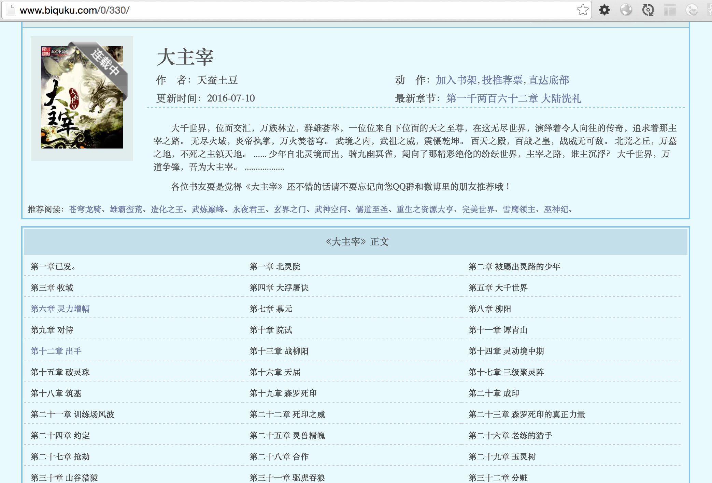

# 使用node-crawler和jsdom完成爬虫

## 初衷

从天蚕土豆的《大主宰》Huge Dominate

起点上是付费的，不经常看，偶尔看看而已，付费没啥意思。于是找免费的

http://www.biquku.com/0/330/

即使说无弹窗，可是还是有很多广告。。。

作为一个有追求的程序员能忍么？

## node-crawler说明

爬取《大主宰》的所有章节列表




```
var Crawler = require("crawler");
var jsdom = require('jsdom');

var c = new Crawler({
    jQuery: jsdom,
    maxConnections : 100,
    forceUTF8:true,
  // incomingEncoding: 'gb2312',
    // This will be called for each crawled page
    callback : function (error, result, $) {
      var urls = $('#list a');
      console.log(urls)
    }
});

c.queue('http://www.biquku.com/0/330/');
```

执行

```
node examples/1/hello-crawler.js
```

## 解析章节信息

代码

```
var Crawler = require("crawler");
var jsdom = require('jsdom');

var current_book = { }

var c = new Crawler({
    jQuery: jsdom,
    maxConnections : 100,
    forceUTF8:true,
  // incomingEncoding: 'gb2312',
    // This will be called for each crawled page
    callback : function (error, result, $) {
      var urls = $('#list a');
      // console.log(urls)
      
      
      current_book.title = $('#maininfo h1').text()
      current_book.author = $('#info p').eq(0).text()
      current_book.update_time = $('#info p').eq(2).text()
      current_book.latest_chapter = $('#info p').eq(3).html()
      current_book.intro = $('#intro').html()
      current_book.chapters = [];

      for(var i = 0; i< urls.length; i++){
        var url = urls[i]
        
        var _url = $(url).attr('href')+"";
        var num = _url.replace('.html','');
        var title = $(url).text();


        current_book.chapters.push({
          num: num,
          title: title,
          url: _url
        })
      }
      
      console.log(current_book)
    }
});

c.queue('http://www.biquku.com/0/330/');
```

这里主要是拿jQuery解析dom。然后赋值current_book

执行

```
node examples/1/chaper-list.js
{ title: '大主宰',
  author: '作    者：天蚕土豆',
  update_time: '更新时间：2016-07-10',
  latest_chapter: '最新章节：<a href="4091426.html" target="_blank">第一千两百六十二章 大陆洗礼</a>',
  intro: '\n\t\t\t\t\t<p>    大千世界，位面交汇，万族林立，群雄荟萃，一位位来自下位面的天之至尊，在这无尽世界，演绎着令人向往的传奇，追求着那主宰之路。\n    无尽火域，炎帝执掌，万火焚苍穹。\n    武境之内，武祖之威，震慑乾坤。\n    西天之殿，百战之皇，战威无可敌。\n    北荒之丘，万墓之地，不死之主镇天地。\n    ......\n    少年自北灵境而出，骑九幽冥雀，闯向了那精彩绝伦的纷纭世界，主宰之路，谁主沉浮？\n    大千世界，万道争锋，吾为大主宰。\n    ..................\n</p>\n\t\t\t\t\t<p>各位书友要是觉得《大主宰》还不错的话请不要忘记向您QQ群和微博里的朋友推荐哦！</p>\n\t\t\t\t',
  chapters: 
   [ { num: '153064', title: '第一章已发。', url: '153064.html' },
     { num: '153065', title: '第一章 北灵院', url: '153065.html' },
     { num: '153066', title: '第二章 被踢出灵路的少年', url: '153066.html' },
     { num: '153067', title: '第三章 牧域', url: '153067.html' },
     { num: '153068', title: '第四章 大浮屠诀', url: '153068.html' },
```

想要的信息都准备好了，下面就开始爬某一章吧

## 爬取某一章

看一下

```
第一章 北灵院
http://www.biquku.com/0/330/153065.html
```

和之前的地址的差别是什么呢？

- http://www.biquku.com/0/330 是一样的
- 153065.html章节地址

再回顾一下

```
  chapters: 
   [ { num: '153064', title: '第一章已发。', url: '153064.html' },
```

也就是说 url 即是章节地址，剩下的就拼接起来就好了。


```
function one(chapter){
  console.log(chapter)
  c.queue([{
    uri: 'http://www.biquku.com/0/330/' + chapter.num + '.html',
    jQuery: jsdom,
    forceUTF8:true,
    // The global callback won't be called
    callback: function (error, result, $) {
        var content = $('#content').html();
        console.log(content)
    }
  }]);
}
```

模拟执行代码

```
var chapter = { num: '4063307', title: '第一千两百五十二章 现世！', url: '4063307.html' }

one(chapter);
```

执行

```
node examples/1/chaper-one.js
{ num: '4063307', title: '第一千两百五十二章 现世！', url: '4063307.html' }
&nbsp;&nbsp;&nbsp;&nbsp;第一千两百五十二章<br><br>&nbsp;&nbsp;&nbsp;&nbsp;轰轰！<br><br>&nbsp;&nbsp;&nbsp;&nbsp;灵战子的低吼声，犹如雷鸣一般在这天地之间回荡，一股股磅礴浩瀚的灵力，也是犹如洪流一般，不断的从其体内呼啸而出，引得空间震荡。◇↓，<br><br>&nbsp;&nbsp;&nbsp;&nbsp;此时的灵战子，双目精光涌动，神采飞扬，再没了先前的那种虚弱之感，显然，借助着那所谓的“战祭”，他直接是在顷刻间就将自身状态恢复到了巅峰。<br><br>&nbsp;&nbsp;&nbsp;&nbsp;之前消耗的灵力，也是再度充盈了他的身躯。
```

## 总结

爬取一本书的流程

- 先取列表
- 再去章节

技能

- node-crawler 爬取，发送http请求，是基于request模块的
- 结合jsdom，使用类似于jquery的dom操作，解析结果

node-crawler有2种用法

- c.queue方法如无callback，走全局的callback，这是获取列表的时候的用法
- c.queue方法如有callback，走自己的callback，这是获取章节的用法

我们的做法

- 最小化问题，先关注爬取一本书的流程
- 爬取一本书的流程中的列表
- 爬取一本书的流程中的章节

在这个过程中，我们可以很好的学习node-crawler和jquery的dom操作，知识点整体来说比较少，更加容易学习。

下面，爬取的信息咋办呢？见下一章。